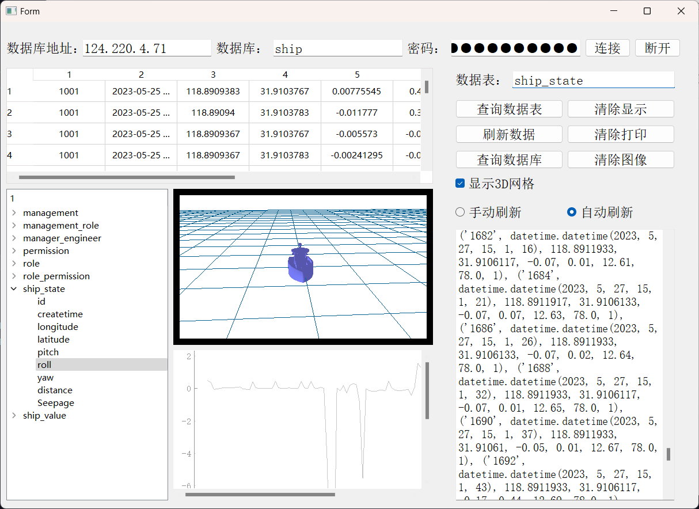
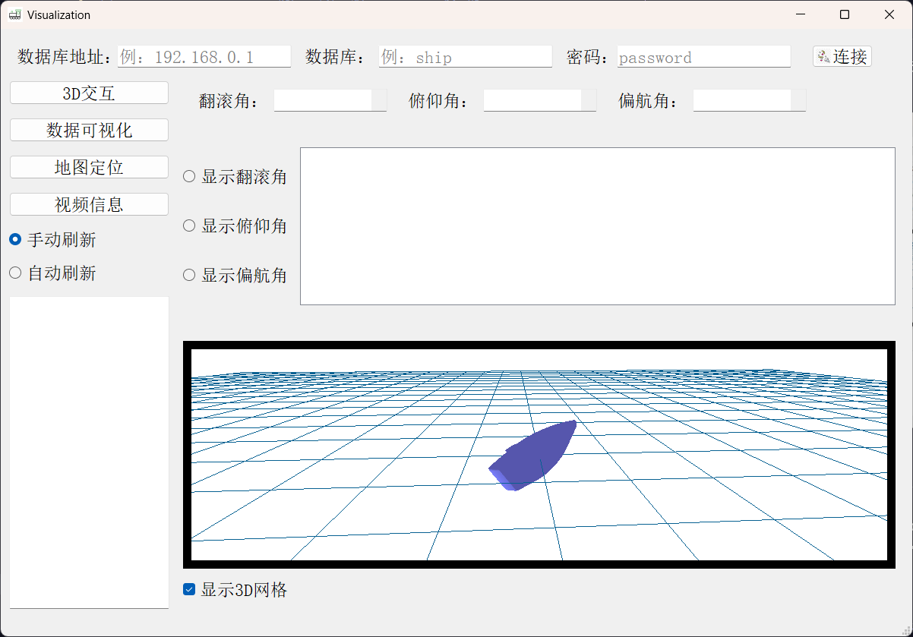
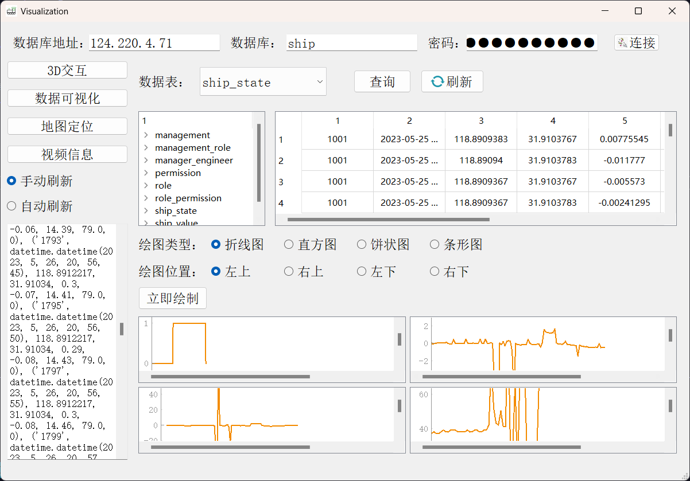
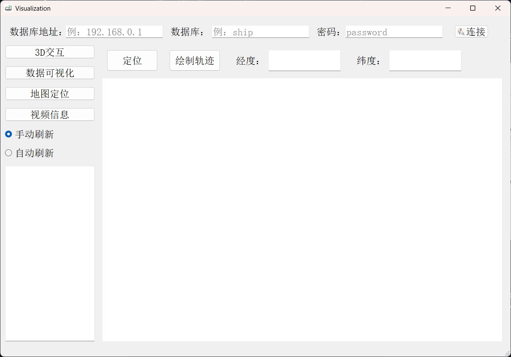
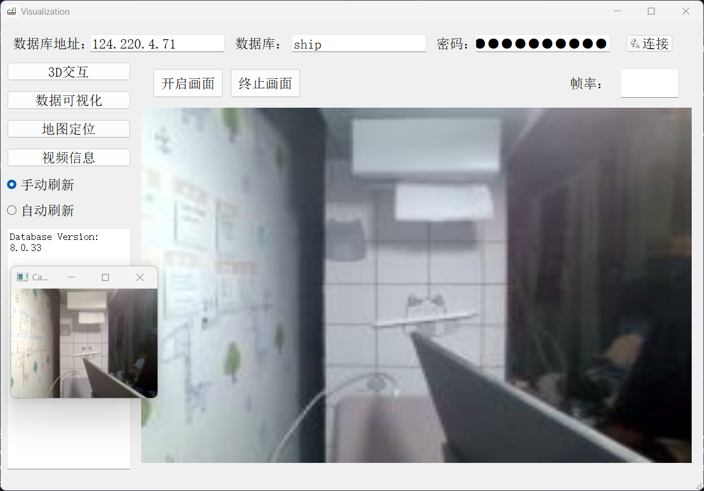

# Pyqt_visualization
使用pyqt实现数据可视化与3D模型的交互  

  **显示效果：**


## 打包命令
```
pyinstaller -w -i .\GUI_icon\main_icon.ico --add-data ".\model\little_ship.STL;." .\main.py
```

### 图像发送端
```
{
  "ProductKey": "a1YGTqzEyRl",
  "DeviceName": "vedio",
  "DeviceSecret": "af12059a54ad89fb4b31b8f3dd5aec3d"
}
a1YGTqzEyRl.iot-as-mqtt.cn-shanghai.aliyuncs.com
C:\Users\16684>ping a1YGTqzEyRl.iot-as-mqtt.cn-shanghai.aliyuncs.com

正在 Ping vpc-sh-prod.mqtt.iotgds.aliyuncs.com.gds.alibabadns.com [139.224.42.2] 具有 32 字节的数据:
来自 139.224.42.2 的回复: 字节=32 时间=75ms TTL=86
来自 139.224.42.2 的回复: 字节=32 时间=30ms TTL=86
来自 139.224.42.2 的回复: 字节=32 时间=43ms TTL=86
来自 139.224.42.2 的回复: 字节=32 时间=27ms TTL=86

139.224.42.2 的 Ping 统计信息:
    数据包: 已发送 = 4，已接收 = 4，丢失 = 0 (0% 丢失)，
往返行程的估计时间(以毫秒为单位):
    最短 = 27ms，最长 = 75ms，平均 = 43ms

{
  "clientId":"a1YGTqzEyRl.vedio|securemode=2,signmethod=hmacsha256,timestamp=1698545278159|",
  "username":"vedio&a1YGTqzEyRl",
  "mqttHostUrl":"a1YGTqzEyRl.iot-as-mqtt.cn-shanghai.aliyuncs.com","passwd":"125a17a7f6d33f2ed19029817ad02c0728e9aec3daa7f8c24a09ac24ac6e5a33",
  "port":1883
}
/sys/a1YGTqzEyRl/vedio/thing/event/property/post   发布
/a1YGTqzEyRl/vedio/user/update
上报属性消息的格式:  
{"method":"thing.event.property.post","params":{"image":"1234567890"}}

/sys/a1YGTqzEyRl/vedio/thing/service/property/set  订阅
```

### 图像接受端
```
{
  "ProductKey": "a1YGTqzEyRl",
  "DeviceName": "vedio2",
  "DeviceSecret": "4da59f51dde911996ac6f34544a6e013"
}
{
  "clientId":"a1YGTqzEyRl.vedio2|securemode=2,signmethod=hmacsha256,timestamp=1698546181835|",
  "username":"vedio2&a1YGTqzEyRl",
  "mqttHostUrl":"a1YGTqzEyRl.iot-as-mqtt.cn-shanghai.aliyuncs.com","passwd":"26b5de108b305237fbaa64f892d95bc17b114dc1e09848d839a12c76c5ad80b3",
  "port":1883
}
/sys/a1YGTqzEyRl/vedio2/thing/event/property/post   发布
上报属性消息的格式:  
{"method":"thing.event.property.post","params":{"image":"1234567890"}}

/sys/a1YGTqzEyRl/vedio2/thing/service/property/set  订阅
/a1YGTqzEyRl/vedio2/user/get

```


# 可视化方案第二版
##  3D模型的显示


##  数据可视化


## 地图定位


## 视频传输
