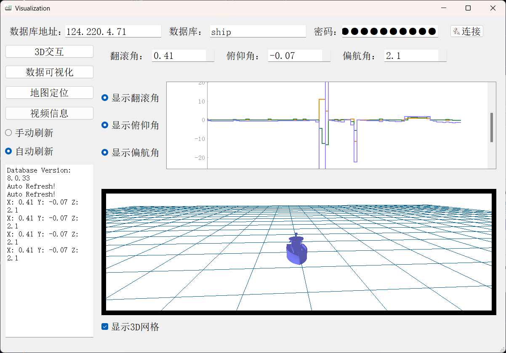

# Pyqt_visualization
使用pyqt实现数据可视化与3D模型的交互  

  **显示效果：**


## 打包命令
```
pyinstaller -w -i .\GUI_icon\main_icon.ico --add-data ".\model\little_ship.STL;." .\main.py
```


# 可视化方案第二版
##  3D模型的显示


##  数据可视化


## 地图定位


## 视频传输
